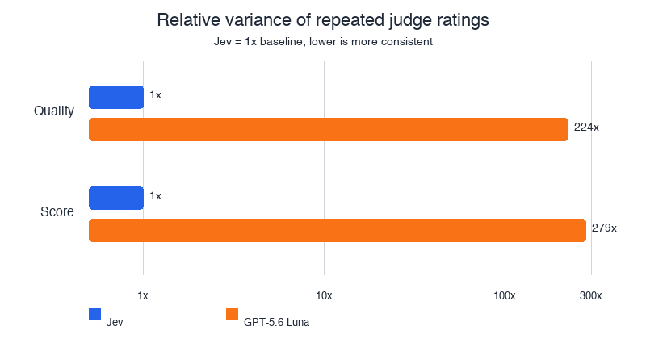
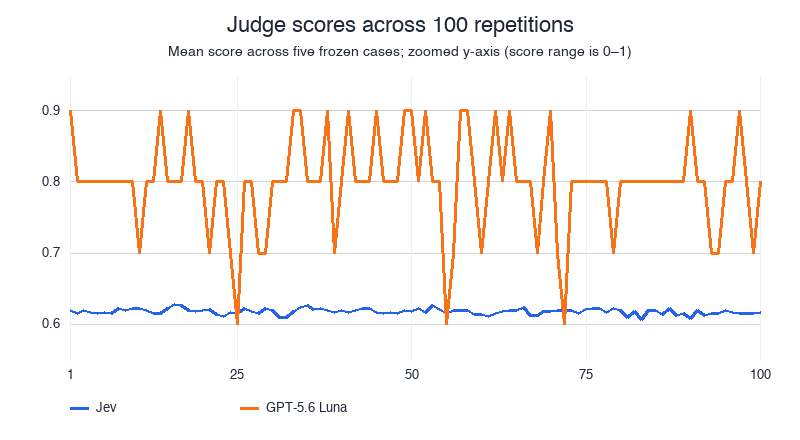

# Jev as a Judge

This project evaluates a DeepAgents weather agent that uses Tavily to find current conditions and forecasts. The evaluator is powered by [Jev](https://docs.typesafe.ai/introduction), TypeSafe's flagship System One model. The same evaluators were built with Jev and a GPT model. Both evaluators were used in an experiment. The goal wasn't to determine how *aligned* the evaluators were, but rather to grade their variance.

## Latest judge reliability result

We ran 100 judge repetitions on the same five frozen agent outputs, so the measured variation comes from the judges rather than the weather agent or web search.

Variance measures how much a judge's repeated ratings move around on the same answer. Lower variance means a more consistent judge. The ratio shows how much more the GPT judge's ratings varied than Jev's.

| Metric | What it means | Jev average | GPT average | GPT variance vs. Jev |
| --- | --- | ---: | ---: | ---: |
| Quality | Average of groundedness, search behavior, and usefulness checks, each from 0 to 1 | 0.926 | 0.980 | 224× higher |
| Score | A 0–1 version of the poor / adequate / excellent rubric | 0.618 | 0.798 | 279× higher |

The reliability result is the spread. GPT's quality ratings varied 224× more and its rubric scores varied 279× more. Outcome disagreement was 0% for Jev and 0.2% for GPT.





The 100-repetition run is recorded in [LangSmith](https://smith.langchain.com/o/fd6b1198-8e6a-4f06-80f5-20e1b40ded12/datasets/fc68427d-1695-49eb-901b-fb4c733c24bc/compare?selectedSessions=ff3d8aa4-28c4-482e-aa54-1ff1f2b604ba). One LLM request timed out, so treat these numbers as preliminary. Results are based on five cases, not a universal ranking of judges. Run it again with:

```bash
uv run python src/evals/judge_reliability.py
```

The script reports means, standard deviations, bootstrap 95% confidence intervals, variance differences, and variance ratios. Use `--local` to run without uploading an experiment.

### Cost

For the older 100-repetition experiment, Jev cost `$0.30` and GPT-5.6 Luna cost about `$0.36`. Jev was **17% cheaper** than GPT for this run, according to the provider-reported Jev total and LangSmith Gateway usage metadata.

## Why Jev for evals?

Traditional LLM judges generate text that an application must interpret. Jev is designed to make structured decisions directly: it evaluates typed questions against structured state and returns typed answers without an explanation-parsing step.

That makes Jev a natural fit for evaluator logic:

- `Noul` returns the probability that a yes/no judgment is true.
- `Score` rates an answer against an ordered rubric and returns probabilities and confidence.
- `Choice` selects one option and returns probabilities and confidence.
- Multiple atomic questions can be evaluated in parallel against the same state.

This project sends Jev the weather question, the agent's final answer, Tavily evidence, tool calls, and expected behavior. It runs three judge interactions: Noul checks groundedness, search behavior, and usefulness; Score rates the response on a quality rubric; and Choice classifies the outcome as answered, clarification-needed, or poor. The Noul probabilities become a LangSmith score, while the Score and Choice outputs are recorded as separate metrics.

The point is not that one judge is universally better. Jev gives this evaluator typed, composable signals that are easy to combine, threshold, and inspect.

## Return types and evaluation strategies

Choose the TypeSafe primitive based on the shape of the decision you need to make:

| Return type | What it returns | Evaluation strategy | This project |
| --- | --- | --- | --- |
| `Noul` | A `0`–`1` probability that a yes/no statement is true | Threshold it for pass/fail checks, or combine several probabilities into one quality metric | `jev_weather_quality` checks groundedness, search behavior, and usefulness |
| `Score` | A numeric position on an ordered rubric, plus probabilities and confidence | Rank responses, track regressions, or set quality thresholds against a rubric | `jev_weather_score` rates the answer from poor to excellent |
| `Choice` | One category, plus probabilities and confidence | Segment outcomes, identify failure modes, or route examples for review | `jev_weather_choice` classifies answers as answered, clarification-needed, or poor |

In practice, use `Noul` for focused invariants, `Score` when quality has meaningful levels, and `Choice` when the next action depends on a discrete outcome. Score and Choice expose confidence, which can identify borderline examples for manual review; Noul is best treated as a probability for a binary decision.

## Quick start

Requires Python 3.13+, a Tavily API key, a TypeSafe API key, and a workspace-scoped LangSmith API key with Gateway access.

```bash
cp .env.example .env
# Add your API keys to .env
uv sync
```

Optionally create the LangSmith dataset ahead of time:

```bash
uv run python src/evals/dataset.py
```

Run the local weather-agent evaluation. This uses the examples in `src/evals/dataset.py`, pretty-prints each Jev result, and does not require the dataset to exist in LangSmith:

```bash
uv run python main.py
```

To upload the dataset and record an evaluation experiment in LangSmith, run:

```bash
uv run python src/evals/offline_evals.py
```

The evaluation runner creates the `weather-agent` dataset if it is missing and reuses it on later runs. Run `src/evals/dataset.py` separately only when you want to create or inspect the dataset without running an experiment.

Run only the sample weather agent directly:

```bash
uv run python -m weather_agent.main
```

## Configuration

The main settings are in `.env`:

| Variable | Purpose |
| --- | --- |
| `TAVILY_API_KEY` | Web search used by `search_weather` |
| `TYPESAFE_API_KEY` | Jev evaluator access |
| `LANGSMITH_API_KEY` | LangSmith, Gateway, dataset, and evaluation access |
| `LANGSMITH_GATEWAY` | Routes the weather agent through LangSmith Gateway; set to `true` |
| `LANGSMITH_TRACING` | Enables LangSmith traces; set to `true` |
| `LANGSMITH_PROJECT` | LangSmith project for traces |
| `WEATHER_AGENT_MODEL` | Model string, defaulting to `openai:gpt-5.5` |

## How the evaluation is wired

```text
weather question
      |
      v
DeepAgent -- search_weather --> Tavily evidence
      |
      v
final answer + evidence + tool calls + expectations
      |
      v
Jev: Noul + Score + Choice judges
      |
      v
LangSmith score and trace
```

Each Jev interaction is wrapped with LangSmith's `@traceable` decorator, so `jev_weather_judge`, `jev_weather_score`, and `jev_weather_choice` appear as nested traces when tracing is enabled.

## Project layout

- `src/weather_agent/agent.py` — DeepAgents weather agent and Tavily tool.
- `src/evals/dataset.py` — Creates the `weather-agent` LangSmith dataset.
- `src/evals/judges.py` — Jev-based evaluator and typed questions.
- `src/evals/offline_evals.py` — Runs the agent over the dataset and uploads results.
- `langgraph.json` — Registers the weather agent for LangGraph tooling.

## Official documentation

- [TypeSafe introduction](https://docs.typesafe.ai/introduction)
- [TypeSafe Python quick start](https://docs.typesafe.ai/introduction/quickstart)
- [TypeSafe primitives](https://docs.typesafe.ai/primitives)
- [Noul](https://docs.typesafe.ai/primitives/noul)
- [Score](https://docs.typesafe.ai/primitives/score)
- [Confidence](https://docs.typesafe.ai/confidence)
- [TypeSafe API reference](https://docs.typesafe.ai/api)
- [LangSmith evaluation quickstart](https://docs.langchain.com/langsmith/evaluation-quickstart)
- [LangSmith `@traceable`](https://docs.langchain.com/langsmith/annotate-code)
- [DeepAgents quickstart](https://docs.langchain.com/oss/python/deepagents/quickstart)
