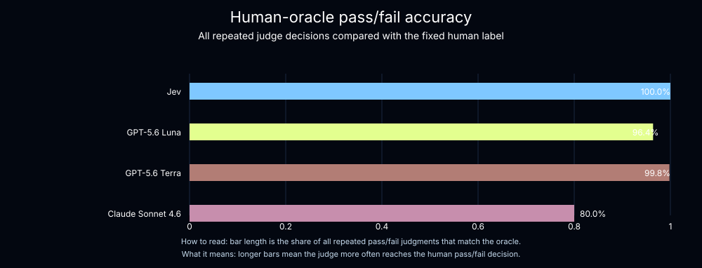
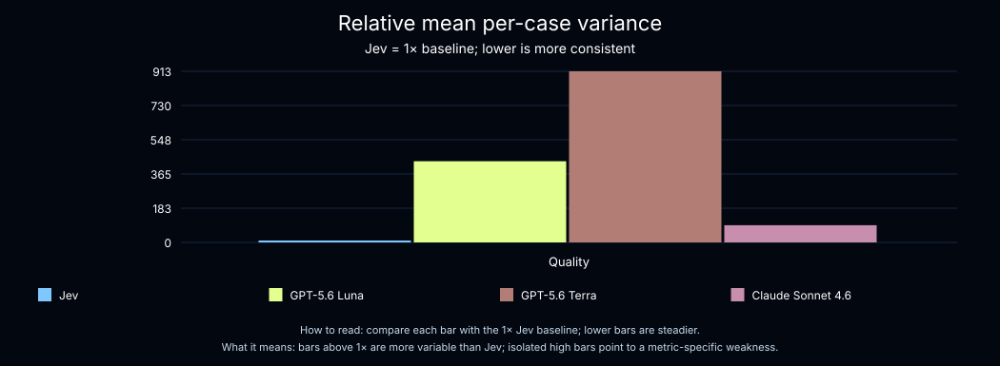
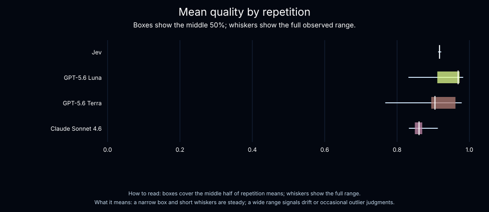
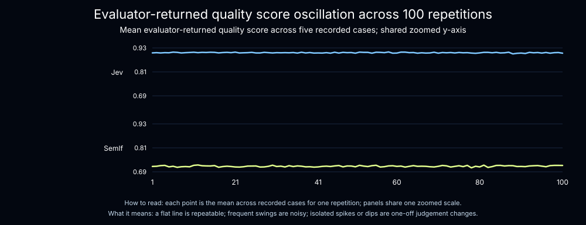
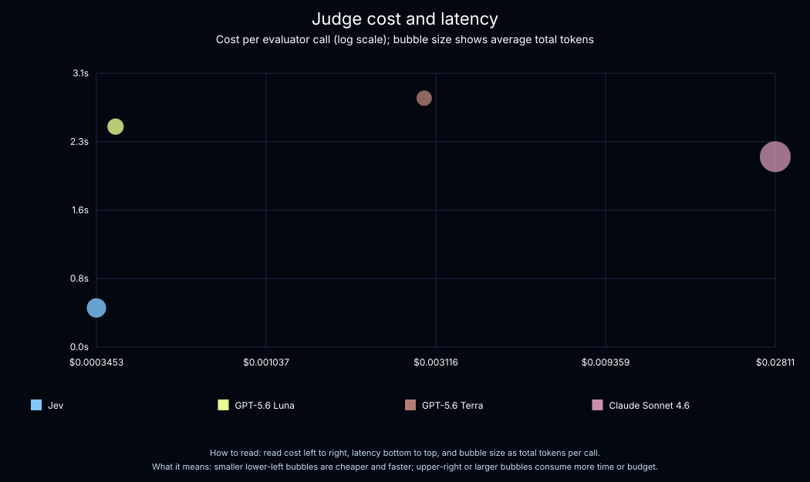

# Jev as a judge for agent evals

Agent evaluators usually fall into two categories: deterministic code and LLM-as-a-judge. Code is fast and reliable but limited to behavior that can be expressed as explicit logic. LLM judges can evaluate open-ended agent behavior, but they add cost, latency, and variance.

This project tests a third option: [Jev](https://docs.typesafe.ai/introduction), TypeSafe AI's System One decision model. The archived experiment compares Jev with GPT-5.6 Luna, GPT-5.6 Terra, and Claude Sonnet 4.6 on recorded weather-agent responses. We measure oracle agreement, score reliability, cost, and latency.

## What is Jev?

Jev is not an autoregressive LLM and does not generate text. It evaluates typed questions against structured state and returns typed answers with probabilities.

Jev supports three question types:

| Type | What it returns | Example evaluator question |
| --- | --- | --- |
| `Noul` | Probability that a yes-or-no judgment is true | Is the final answer grounded in the retrieved evidence? |
| `Score` | An ordered rubric score, probabilities, and confidence | How useful is the answer? |
| `Choice` | One option, probabilities, and confidence | Did the agent search appropriately? |

Multiple atomic questions can be evaluated in parallel against the same state.

## Why use a decision model as a judge?

Agent evaluation is a decision task: given an agent's state and behavior, assign a score that provides feedback. Jev is designed for this pattern. It evaluates typed questions against structured state and returns typed answers with probabilities. Autoregressive models, on the other hand, reach a judgment through token-by-token generation. In our experiment, that decision-first design coincided with lower latency, lower cost, and lower variance.

That does not make any judge correct by default. A repeatable evaluator can still be consistently wrong, so we compare each judge with human labels and keep accuracy separate from reliability.

## Experiment

We built a weather agent with [Deep Agents](https://www.langchain.com/deep-agents) and gave it access to Tavily web search. We defined five cases:

| Request type | Location | User need |
| --- | --- | --- |
| Current conditions | Seattle | Report the weather right now |
| Weekend forecast | Austin | Describe the expected weekend weather |
| Decision support | Dublin | Decide whether to bring an umbrella |
| Longer-range forecast | Tokyo | Report the extended forecast |
| Ambiguous location | Springfield | Handle a request without a unique place |

For the archived experiment, we ran the weather agent once per case and recorded its final answer, search evidence, tool calls, and expected behavior. Each repetition then reused those responses, so only the judges could introduce variation.

The current workflow stores a separate, permanent dataset named `weather-agent-recorded-context-safe-v1`. Each example contains the question, a GPT-5.5 recorded response, expected behavior, manual oracle labels with reasoning, and metadata. Search evidence is stored as at most four compact cards, and the five serialized judge states range from 282 to 3,252 characters. Reliability experiments return each recorded response unchanged and do not invoke the weather agent.

Each judge evaluated the five recorded responses 100 times with three signals:

| Evaluator | What it measures | Output |
| --- | --- | --- |
| `quality` | Grounding, search behavior, and usefulness | Continuous score from `0` to `1` |
| `does_pass` | Overall success | Binary decision: `0` or `1` |
| `outcome` | Response outcome | `answered`, `clarification_needed`, or `poor` |

A human reviewer labeled each recorded response against the same rubric. The archived experiment reports binary oracle accuracy and quality variance.

## Results

### Accuracy

Accuracy measures whether a judge's binary `does_pass` decision agrees with the human oracle. Across 500 repeated decisions per judge, Jev matched every human pass-or-fail label.

| Judge | Pass-or-fail accuracy |
| --- | ---: |
| Jev | 100.0% |
| GPT-5.6 Terra | 99.8% |
| GPT-5.6 Luna | 96.4% |
| Claude Sonnet 4.6 | 80.0% |



This is a small corpus with five agent runs and one human reviewer. The result describes this experiment; it is not a general ranking of judge accuracy.

### Reliability

Reliability asks whether a judge produces the same score when the agent behavior is unchanged. We measured it using the observed variance of each judge's continuous `quality` scores. Lower variance is better.

Jev had the lowest observed mean per-case variance: `0.0000149`. Luna was `433×` higher, Terra was `913×` higher, and Claude was `92×` higher.

| Judge | Mean quality variance | Relative to Jev |
| --- | ---: | ---: |
| Jev | 0.0000149 | 1× |
| GPT-5.6 Luna | 0.00647 | 433× |
| GPT-5.6 Terra | 0.01364 | 913× |
| Claude Sonnet 4.6 | 0.00137 | 92× |





This experiment cannot establish why Jev varied less. One hypothesis is that a model designed to return bounded decisions is a better fit for this task than a model designed for autoregressive generation. The result is observational, not evidence that the model architecture caused the lower variance.

### SemIf reliability comparison

A second experiment compared Jev with SemIf on the permanent recorded-context dataset. SemIf's mean per-case quality variance was `0.0000323`, or `1.70×` Jev's variance in the same run.

| Judge | Mean quality variance | Jev variance in the same experiment | Relative to Jev |
| --- | ---: | ---: | ---: |
| Jev | 0.0000190 | 0.0000190 | 1× |
| SemIf | 0.0000323 | 0.0000190 | 1.70× |
| Claude Sonnet 4.6 | 0.00137 | 0.0000149 | 92× |
| GPT-5.6 Luna | 0.00647 | 0.0000149 | 433× |
| GPT-5.6 Terra | 0.01364 | 0.0000149 | 913× |

The table is sorted by observed mean quality variance. Each relative score uses the Jev result from the same experiment, so the SemIf run and archived oracle run retain their paired baselines.



### Cost

| Judge | Average cost per call | Average latency | Total evaluator cost |
| --- | ---: | ---: | ---: |
| Jev | $0.00035 | 0.44 s | $0.34 |
| GPT-5.6 Luna | $0.00039 | 2.50 s | $0.39 |
| GPT-5.6 Terra | $0.00289 | 2.83 s | $2.90 |
| Claude Sonnet 4.6 | $0.02811 | 2.16 s | $28.17 |

At $0.00035 per call, Jev makes repeated judgments and frequent regression checks inexpensive. These costs depend on the prompts, inputs, and provider pricing at the time of the run.



## What abundant evaluation changes

The important result is not simply a lower evaluation bill. When high-quality judgment becomes cheap enough to use broadly, builders can evaluate more agent runs, test more dimensions, and measure more changes without narrowing the feedback loop around cost.

That can speed up the entire agent development lifecycle. Agent engineers can turn more traces into feedback, catch regressions sooner, and move faster as they build, test, monitor, and deploy agents. Low cost can also amplify mistakes, so human review, representative datasets, and judge alignment still matter.

## Run the project

Requires Python 3.13+, a Tavily API key, a workspace-scoped LangSmith API key, and a LangSmith Gateway key authorized for the configured judge models.

```bash
cp .env.example .env
# Add your API keys to .env
uv sync
```

Run the weather agent:

```bash
uv run python -m weather_agent
```

The permanent dataset already exists in the LangSmith workspace used for this repository. In a new workspace, run its creator once. The command intentionally fails if the dataset name already exists:

```bash
uv run python -m evals.datasets.recorded
```

Reproduce the repeated-judge benchmark:

```bash
uv run python -m evals.reliability.experiment
```

This runs Jev and SemIf against the stored responses. It defaults to 100 repetitions with two concurrent evaluator calls. Use `--trials` and `--max-concurrency` to change those values.

Archive a completed experiment:

```bash
uv run python -m evals.reliability.archive EXPERIMENT_ID \
  --output assets/EXPERIMENT_ID/benchmark.json
```

Inspect trace metrics or generate SVGs:

```bash
uv run python -m evals.analysis.traces EXPERIMENT_ID
uv run python -m evals.analysis.visualize EXPERIMENT_ID
```

Run the test suite:

```bash
uv run python -m unittest discover -s tests -v
```

### Configuration

| Variable | Purpose |
| --- | --- |
| `TAVILY_API_KEY` | Web search used by the weather agent |
| `LANGSMITH_API_KEY` | LangSmith tracing, datasets, evaluation, and OpenAI Gateway access |
| `LS_LLM_GATEWAY_KEY` | LangSmith Gateway access for Jev, SemIf, and Claude |
| `LANGSMITH_GATEWAY` | Routes the weather agent through LangSmith Gateway; command entry points force it to `true` |
| `LANGSMITH_TRACING` | Enables LangSmith traces when `true` |
| `LANGSMITH_PROJECT` | LangSmith project for traces |
| `WEATHER_AGENT_MODEL` | Model used by `python -m weather_agent`; dataset generation is fixed to `openai:gpt-5.5` |

## Reproducibility

The published LangSmith experiment is `benchmark-jev-luna-terra-sonnet` (`6d08df72-c878-458c-b7c5-a7824ee6e721`), started at `2026-09-18T17:53:25Z`.

- [Recorded cases and variance analysis](./assets/benchmark-jev-luna-terra-sonnet/6d08df72-c878-458c-b7c5-a7824ee6e721/benchmark.json)
- [Human oracle labels](./assets/benchmark-jev-luna-terra-sonnet/6d08df72-c878-458c-b7c5-a7824ee6e721/oracle-labels.json)
- [Generated result assets](./assets/benchmark-jev-luna-terra-sonnet-oracle/6d08df72-c878-458c-b7c5-a7824ee6e721/)

The permanent `weather-agent-recorded-context-safe-v1` dataset was created after the archived experiment. It is the source of truth for the Jev and SemIf experiment (`aaa78b6a-f6be-4542-a125-1941c7a8b5df`) and future reliability runs.

The LLM judges ran through LangSmith Gateway with `openai/gpt-5.6-luna`, `openai/gpt-5.6-terra`, and `anthropic/claude-sonnet-4-6`. Jev ran through `langchain-typesafe==0.0.1a2`. The experiment used `deepagents==0.7.15`, `langchain-openai==1.6.2`, `langsmith==0.12.6`, and `tavily-python==0.8.3`.

We did not set temperature, top-p, seed, or max tokens for the LLM judges, so provider and gateway defaults applied. The experiment metadata did not expose the hosted Jev service version.

## Project layout

- `src/weather_agent/` — Deep Agents weather agent and compact Tavily search tool
- `src/evals/datasets/` — Cases and recorded LangSmith dataset creation
- `src/evals/judges/` — Judge state, System One, and LLM evaluators
- `src/evals/reliability/` — Statistics, experiment orchestration, and archiving
- `src/evals/analysis/` — Accuracy, variance, cost, latency, and visualization
- `assets/` — Archived benchmark data and generated charts
- `tests/` — Dataset, judge-state, statistics, oracle-scoring, and trace-metric tests

## References

- [TypeSafe introduction](https://docs.typesafe.ai/introduction)
- [TypeSafe primitives](https://docs.typesafe.ai/primitives)
- [LangSmith evaluation quickstart](https://docs.langchain.com/langsmith/evaluation-quickstart)
- [LangSmith LLM-as-a-judge](https://docs.langchain.com/langsmith/llm-as-judge)
- [Deep Agents quickstart](https://docs.langchain.com/oss/python/deepagents/quickstart)
