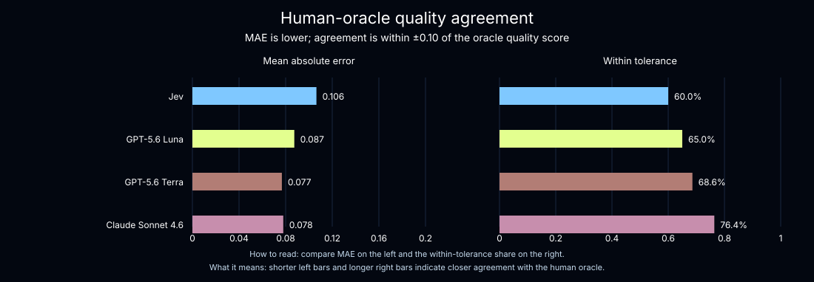
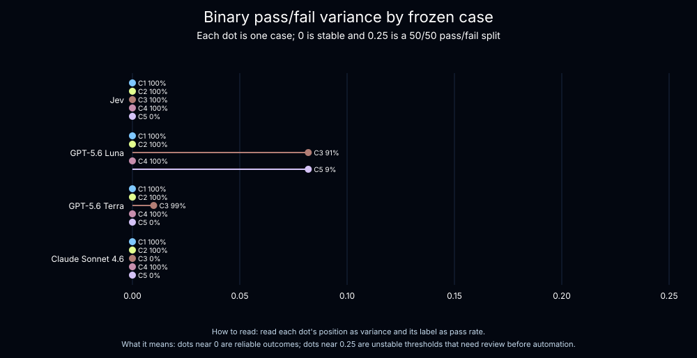
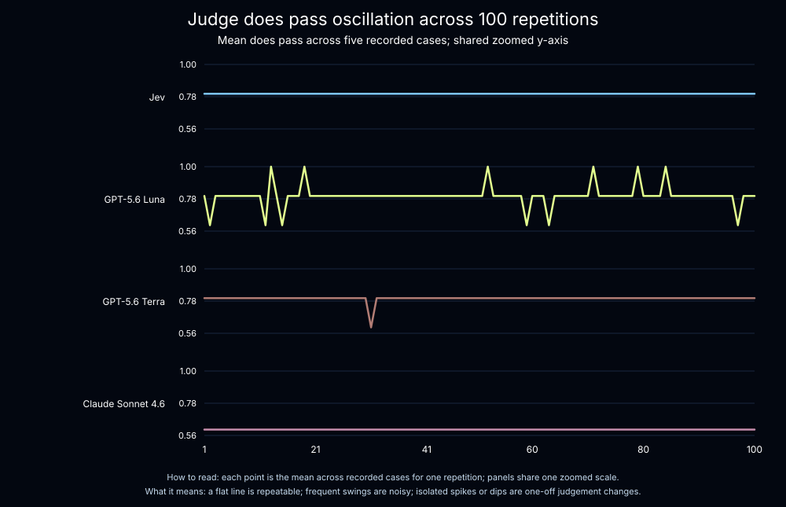

# Jev as a Judge

This project evaluates a DeepAgents weather agent that uses Tavily to find current conditions and forecasts. Its offline judge experiment compares [Jev](https://docs.typesafe.ai/introduction), TypeSafe's System One model, with GPT-5.6 Luna, GPT-5.6 Terra, and Claude Sonnet 4.6.

## Offline judge experiment

The `benchmark-jev-luna-terra-sonnet` offline judge experiment replays five fixed weather-agent outputs 100 times for each judge. The final answer, evidence, tool calls, and expected behavior are frozen, so differences across repetitions come from the judges rather than the weather agent.

Each judge returns an aggregate `quality` score and a binary `does_pass` score. Quality is the mean of groundedness, expected search behavior, and usefulness. A single human reviewer labeled those same three fields plus pass/fail for each frozen response; the labels are in [oracle-labels.json](./assets/benchmark-jev-luna-terra-sonnet/6d08df72-c878-458c-b7c5-a7824ee6e721/oracle-labels.json).

### Accuracy

Pass/fail accuracy compares all 500 repeated decisions per judge with the fixed human label. Quality is continuous, so the experiment reports mean absolute error (MAE; lower is better) and the share of scores within ±0.10 of the human quality score.

| Judge | Pass/fail accuracy | Quality MAE | Quality within ±0.10 |
| --- | ---: | ---: | ---: |
| Jev | 100.0% | 0.106 | 60.0% |
| GPT-5.6 Luna | 96.4% | 0.087 | 65.0% |
| GPT-5.6 Terra | 99.8% | 0.077 | 68.6% |
| Claude Sonnet 4.6 | 80.0% | 0.078 | 76.4% |

On this small, single-reviewer corpus, Jev matched every human pass/fail label; GPT-5.6 Terra had the lowest quality MAE. These results are descriptive, not a general accuracy claim.

Accuracy and precision answer different questions: accuracy measures agreement with the human oracle, while precision measures whether the judge reaches that judgment consistently. A judge can look accurate on average yet still be unreliable for an individual decision if it changes its verdict on identical inputs.




### Reliability

A lower variance means a judge returns more consistent scores for the same frozen case. That consistency makes observed accuracy more dependable over repeated production decisions, especially near a pass/fail threshold where score noise can flip a verdict. Variance alone is not accuracy, however: a judge can be consistently wrong. Jev's mean per-case quality variance was `0.0000149`; the LLM judges were `92×` to `913×` higher in this offline judge experiment.

| Judge | Mean quality variance | Relative to Jev |
| --- | ---: | ---: |
| Jev | 0.0000149 | 1× |
| GPT-5.6 Luna | 0.00647 | 433× |
| GPT-5.6 Terra | 0.01364 | 913× |
| Claude Sonnet 4.6 | 0.00137 | 92× |


For `does_pass`, the observed Bernoulli variance is `p(1-p)`: zero means every repetition gave the same verdict, while `0.25` is a 50/50 split. Those flips become false passes or false failures whenever the changed verdict disagrees with the human label. Jev and Claude were stable on every case. GPT-5.6 Terra changed on one case (`99%` pass); GPT-5.6 Luna changed on two (`91%` and `9%` pass).





### Cost

| Judge | Average cost per call | Average latency | Total evaluator cost |
| --- | ---: | ---: | ---: |
| Jev | $0.00035 | 0.44 s | $0.34 |
| GPT-5.6 Luna | $0.00039 | 2.50 s | $0.39 |
| GPT-5.6 Terra | $0.00289 | 2.83 s | $2.90 |
| Claude Sonnet 4.6 | $0.02811 | 2.16 s | $28.17 |

At $0.00035 per call in this experiment, Jev made repeated judgments and frequent regression checks inexpensive. These costs depend on the prompts, inputs, and provider pricing at the time of the run.


### Reproduce the offline judge experiment

```bash
uv run python src/evals/judge_reliability.py
```

The script reports means, standard deviations, bootstrap 95% confidence intervals, variance differences, and variance ratios. Use `--local` to run without uploading an experiment.

The published offline judge experiment is `benchmark-jev-luna-terra-sonnet` (`6d08df72-c878-458c-b7c5-a7824ee6e721`), started at `2026-09-18T17:53:25Z`. Its [archived frozen cases and analysis](./assets/benchmark-jev-luna-terra-sonnet/6d08df72-c878-458c-b7c5-a7824ee6e721/benchmark.json) reproduce the variance analysis; its [accuracy report](./assets/benchmark-jev-luna-terra-sonnet-oracle/6d08df72-c878-458c-b7c5-a7824ee6e721/accuracy.json) reproduces the human-oracle results. LLM judges used LangSmith Gateway with `openai/gpt-5.6-luna`, `openai/gpt-5.6-terra`, and `anthropic/claude-sonnet-4-6`; Jev was accessed through `langchain-typesafe==0.0.1a2`. The run used `deepagents==0.7.15`, `langchain-openai==1.6.2`, `langsmith==0.12.6`, and `tavily-python==0.8.3`. No temperature, top-p, seed, or max-token setting was supplied for the LLM judges, so provider and gateway defaults applied. The hosted Jev service version was not exposed by the experiment metadata. The metadata also lists Gemini Flash; it is not included in this report's figures or analysis.

## Why Jev for evals?

Autoregressive LLM judges can take a question, trace, and evidence as unstructured input, then use a prompt to evaluate whether the response addressed the user's request. Jev is designed to make structured decisions directly: it evaluates typed questions against structured state and returns typed answers without an explanation-parsing step.

That makes Jev a natural fit for evaluator logic:

- `Noul` returns the probability that a yes/no judgment is true.
  - E.g.: “Is the final answer grounded in the retrieved evidence?”
  - Response: A `float` from `0.0` to `1.0`, where `1.0` means fully grounded
- `Choice` selects one option and returns probabilities and confidence.
  - E.g.: “Which search outcome best describes this run?”
  - Response: One of `searched_appropriately`, `searched_unnecessarily`, or `failed_to_search`, plus probabilities and confidence
- Multiple atomic questions can be evaluated in parallel against the same state.

This project sends every judge the weather question, the agent's final answer, Tavily evidence, tool calls, and expected behavior. Each judge runs three interactions: quality checks groundedness, search behavior, and usefulness; does_pass returns a pass/fail result; and choice classifies the outcome as answered, clarification-needed, or poor. The resulting metrics are stored under model-specific LangSmith keys.

The point is not that one judge is universally better. Jev gives this evaluator typed, composable signals that are easy to combine, threshold, and inspect.

## Return types and evaluation strategies

Choose the TypeSafe primitive based on the shape of the decision you need to make:

| Return type | What it returns | Evaluation strategy | This project |
| --- | --- | --- | --- |
| `Noul` | A `0`–`1` probability that a yes/no statement is true | Threshold it for pass/fail checks, or combine several probabilities into one quality metric | `jev_weather_quality` checks groundedness, search behavior, and usefulness |
| `Choice` | One category, plus probabilities and confidence | Segment outcomes, identify failure modes, or route examples for review | `jev_weather_choice` classifies answers as answered, clarification-needed, or poor |

In practice, use `Noul` for focused invariants and `Choice` when the next action depends on a discrete outcome. Choice exposes confidence, which can identify borderline examples for manual review; Noul is best treated as a probability for a binary decision.

## Quick start

Requires Python 3.13+, a Tavily API key, a TypeSafe API key, and a workspace-scoped LangSmith API key with Gateway access.

```bash
cp .env.example .env
# Add your API keys to .env
uv sync
```

Optionally create the LangSmith dataset ahead of time:

```bash
uv run python src/evals/dataset.py
```

Run the local weather-agent evaluation. This uses the examples in `src/evals/dataset.py`, pretty-prints every judge result, and does not require the dataset to exist in LangSmith:

```bash
uv run python main.py
```

To upload the dataset and record an evaluation experiment in LangSmith, run:

```bash
uv run python src/evals/offline_evals.py
```

The evaluation runner creates the `weather-agent` dataset if it is missing and reuses it on later runs. Run `src/evals/dataset.py` separately only when you want to create or inspect the dataset without running an experiment.

Run only the sample weather agent directly:

```bash
uv run python -m weather_agent.main
```

## Configuration

The main settings are in `.env`:

| Variable | Purpose |
| --- | --- |
| `TAVILY_API_KEY` | Web search used by `search_weather` |
| `TYPESAFE_API_KEY` | Jev evaluator access |
| `LANGSMITH_API_KEY` | LangSmith tracing, datasets, and evaluation access |
| `LS_LLM_GATEWAY_KEY` | LLM Gateway model invocation |
| `LANGSMITH_GATEWAY` | Routes the weather agent through LangSmith Gateway; set to `true` |
| `LANGSMITH_TRACING` | Enables LangSmith traces; set to `true` |
| `LANGSMITH_PROJECT` | LangSmith project for traces |
| `WEATHER_AGENT_MODEL` | Model string, defaulting to `openai:gpt-5.5` |

The judge labels and gateway model identifiers are:

| Label | Model identifier | Credential |
| --- | --- | --- |
| GPT-5.6 Luna | `openai/gpt-5.6-luna` | `LANGSMITH_API_KEY` |
| GPT-5.6 Terra | `openai/gpt-5.6-terra` | `LANGSMITH_API_KEY` |
| Claude Sonnet 4.6 | `anthropic/claude-sonnet-4-6` | `LS_LLM_GATEWAY_KEY` |

## How the evaluation is wired

```text
weather question
      |
      v
DeepAgent -- search_weather --> Tavily evidence
      |
      v
final answer + evidence + tool calls + expectations
      |
      v
Jev + three LLM judges: quality + does_pass + choice
      |
      v
LangSmith score and trace
```

Each judge interaction is wrapped with LangSmith's `@traceable` decorator, so model-specific quality, pass/fail, and outcome traces appear when tracing is enabled.

## Project layout

- `src/weather_agent/agent.py` — DeepAgents weather agent and Tavily tool.
- `src/evals/dataset.py` — Creates the `weather-agent` LangSmith dataset.
- `src/evals/judges/` — Jev and LLM evaluators.
- `analysis/` — Dynamic experiment visualizations and trace-metric queries.
- `src/evals/offline_evals.py` — Runs the agent over the dataset and uploads results.
- `langgraph.json` — Registers the weather agent for LangGraph tooling.

## Official documentation

- [TypeSafe introduction](https://docs.typesafe.ai/introduction)
- [TypeSafe Python quick start](https://docs.typesafe.ai/introduction/quickstart)
- [TypeSafe primitives](https://docs.typesafe.ai/primitives)
- [Noul](https://docs.typesafe.ai/primitives/noul)
- [Confidence](https://docs.typesafe.ai/confidence)
- [TypeSafe API reference](https://docs.typesafe.ai/api)
- [LangSmith evaluation quickstart](https://docs.langchain.com/langsmith/evaluation-quickstart)
- [LangSmith `@traceable`](https://docs.langchain.com/langsmith/annotate-code)
- [DeepAgents quickstart](https://docs.langchain.com/oss/python/deepagents/quickstart)
