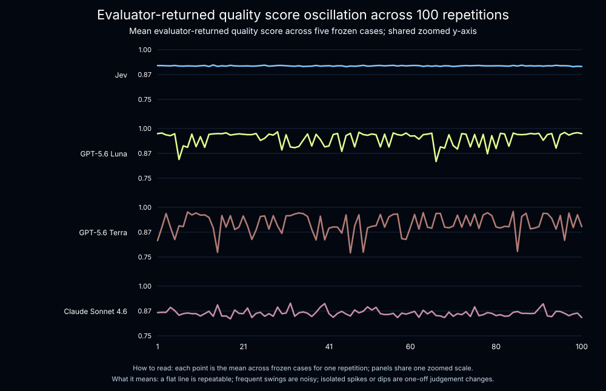

# Jev as a Judge

This project evaluates a DeepAgents weather agent that uses Tavily to find current conditions and forecasts. The evaluator compares [Jev](https://docs.typesafe.ai/introduction), TypeSafe's flagship System One model, with three LLM judges: GPT-5.6 Luna, GPT-5.6 Terra, and Claude Sonnet 4.6. The goal isn't to determine how *aligned* the evaluators are, but rather to grade their variance.

## Latest judge reliability result

The `benchmark-jev-luna-terra-sonnet` experiment replays five fixed weather-agent outputs 100 times for each evaluator. The answer, evidence, tool calls, and expected behavior are fixed, so observed variation comes from the evaluators rather than the weather agent.

### Float and Binary Scores

These judges returned two feedback scores: a quality score and a did_pass score. The quality score is a floating point value between 0 and 1. The did_pass score is a binary value of 0 or 1.

### Float quality score

A lower variance score means the scores the judges returned are more consistent. Jev's mean per-case sample variance was `0.0000149`; the LLM judges were `92×` to `913×` higher in this benchmark.

| Evaluator | Mean quality variance | Relative to Jev |
| --- | ---: | ---: |
| Jev | 0.0000149 | 1× |
| GPT-5.6 Luna | 0.00647 | 433× |
| GPT-5.6 Terra | 0.01364 | 913× |
| Claude Sonnet 4.6 | 0.00137 | 92× |




### Binary pass/fail score

For `does_pass` (a binary score), variance measures whether an evaluator changes its binary verdict: `p(1-p)`, where `p` is the pass rate. It is `0` when every repetition gives the same verdict and reaches `0.25` at a 50/50 split.

Jev and Claude returned the same binary verdict on every case. GPT-5.6 Terra changed only on case 3 (`99%` pass; variance `0.0099`). GPT-5.6 Luna changed on cases 3 and 5 (`91%` and `9%` pass; variance `0.0819` each).


### What this means for Jev

The float and binary results answer different questions. Float quality scores retain small shifts in evaluator confidence or rating, making model-to-model drift visible: GPT-5.6 Terra had the largest float variance, followed by GPT-5.6 Luna and Claude. Binary scores threshold those shifts into pass/fail decisions, so they can have lower observed variance even when the underlying float judgment moves. That is why GPT-5.6 Terra is highly variable on quality while showing low observed variance on `does_pass`.

In this controlled benchmark, **Jev has the lowest observed variance on the continuous quality metric and zero observed binary variance.** That makes it a useful evaluator when a workflow needs stable, typed signals for ranking, thresholding, or automation. **It does not establish evaluator accuracy or alignment: the benchmark contains five cases and measures repeatability, not agreement with human labels.**


Run the benchmark again with:

```bash
uv run python src/evals/judge_reliability.py
```

The script reports means, standard deviations, bootstrap 95% confidence intervals, variance differences, and variance ratios. Use `--local` to run without uploading an experiment.

### Cost

The benchmark's evaluator calls cost approximately `$0.34` for Jev, `$0.39` for GPT-5.6 Luna, `$2.90` for GPT-5.6 Terra, and `$28.17` for Claude Sonnet 4.6. Cost and latency are shown above; they depend on the prompts, inputs, and provider pricing at the time of the run.

## Why Jev for evals?

Traditional LLM judges generate text that an application must interpret. Jev is designed to make structured decisions directly: it evaluates typed questions against structured state and returns typed answers without an explanation-parsing step.

That makes Jev a natural fit for evaluator logic:

- `Noul` returns the probability that a yes/no judgment is true.
- `Choice` selects one option and returns probabilities and confidence.
- Multiple atomic questions can be evaluated in parallel against the same state.

This project sends every judge the weather question, the agent's final answer, Tavily evidence, tool calls, and expected behavior. Each judge runs three interactions: quality checks groundedness, search behavior, and usefulness; does_pass returns a pass/fail result; and choice classifies the outcome as answered, clarification-needed, or poor. The resulting metrics are stored under model-specific LangSmith keys.

The point is not that one judge is universally better. Jev gives this evaluator typed, composable signals that are easy to combine, threshold, and inspect.

## Return types and evaluation strategies

Choose the TypeSafe primitive based on the shape of the decision you need to make:

| Return type | What it returns | Evaluation strategy | This project |
| --- | --- | --- | --- |
| `Noul` | A `0`–`1` probability that a yes/no statement is true | Threshold it for pass/fail checks, or combine several probabilities into one quality metric | `jev_weather_quality` checks groundedness, search behavior, and usefulness |
| `Choice` | One category, plus probabilities and confidence | Segment outcomes, identify failure modes, or route examples for review | `jev_weather_choice` classifies answers as answered, clarification-needed, or poor |

In practice, use `Noul` for focused invariants and `Choice` when the next action depends on a discrete outcome. Choice exposes confidence, which can identify borderline examples for manual review; Noul is best treated as a probability for a binary decision.

## Quick start

Requires Python 3.13+, a Tavily API key, a TypeSafe API key, and a workspace-scoped LangSmith API key with Gateway access.

```bash
cp .env.example .env
# Add your API keys to .env
uv sync
```

Optionally create the LangSmith dataset ahead of time:

```bash
uv run python src/evals/dataset.py
```

Run the local weather-agent evaluation. This uses the examples in `src/evals/dataset.py`, pretty-prints every judge result, and does not require the dataset to exist in LangSmith:

```bash
uv run python main.py
```

To upload the dataset and record an evaluation experiment in LangSmith, run:

```bash
uv run python src/evals/offline_evals.py
```

The evaluation runner creates the `weather-agent` dataset if it is missing and reuses it on later runs. Run `src/evals/dataset.py` separately only when you want to create or inspect the dataset without running an experiment.

Run only the sample weather agent directly:

```bash
uv run python -m weather_agent.main
```

## Configuration

The main settings are in `.env`:

| Variable | Purpose |
| --- | --- |
| `TAVILY_API_KEY` | Web search used by `search_weather` |
| `TYPESAFE_API_KEY` | Jev evaluator access |
| `LANGSMITH_API_KEY` | LangSmith tracing, datasets, and evaluation access |
| `LS_LLM_GATEWAY_KEY` | LLM Gateway model invocation |
| `LANGSMITH_GATEWAY` | Routes the weather agent through LangSmith Gateway; set to `true` |
| `LANGSMITH_TRACING` | Enables LangSmith traces; set to `true` |
| `LANGSMITH_PROJECT` | LangSmith project for traces |
| `WEATHER_AGENT_MODEL` | Model string, defaulting to `openai:gpt-5.5` |

The judge labels and gateway model identifiers are:

| Label | Model identifier | Credential |
| --- | --- | --- |
| GPT-5.6 Luna | `openai/gpt-5.6-luna` | `LANGSMITH_API_KEY` |
| GPT-5.6 Terra | `openai/gpt-5.6-terra` | `LANGSMITH_API_KEY` |
| Claude Sonnet 4.6 | `anthropic/claude-sonnet-4-6` | `LS_LLM_GATEWAY_KEY` |

## How the evaluation is wired

```text
weather question
      |
      v
DeepAgent -- search_weather --> Tavily evidence
      |
      v
final answer + evidence + tool calls + expectations
      |
      v
Jev + three LLM judges: quality + does_pass + choice
      |
      v
LangSmith score and trace
```

Each judge interaction is wrapped with LangSmith's `@traceable` decorator, so model-specific quality, pass/fail, and outcome traces appear when tracing is enabled.

## Project layout

- `src/weather_agent/agent.py` — DeepAgents weather agent and Tavily tool.
- `src/evals/dataset.py` — Creates the `weather-agent` LangSmith dataset.
- `src/evals/judges/` — Jev and LLM evaluators.
- `analysis/` — Dynamic experiment visualizations and trace-metric queries.
- `src/evals/offline_evals.py` — Runs the agent over the dataset and uploads results.
- `langgraph.json` — Registers the weather agent for LangGraph tooling.

## Official documentation

- [TypeSafe introduction](https://docs.typesafe.ai/introduction)
- [TypeSafe Python quick start](https://docs.typesafe.ai/introduction/quickstart)
- [TypeSafe primitives](https://docs.typesafe.ai/primitives)
- [Noul](https://docs.typesafe.ai/primitives/noul)
- [Confidence](https://docs.typesafe.ai/confidence)
- [TypeSafe API reference](https://docs.typesafe.ai/api)
- [LangSmith evaluation quickstart](https://docs.langchain.com/langsmith/evaluation-quickstart)
- [LangSmith `@traceable`](https://docs.langchain.com/langsmith/annotate-code)
- [DeepAgents quickstart](https://docs.langchain.com/oss/python/deepagents/quickstart)
