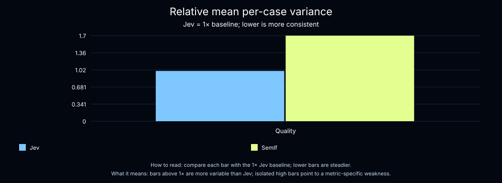
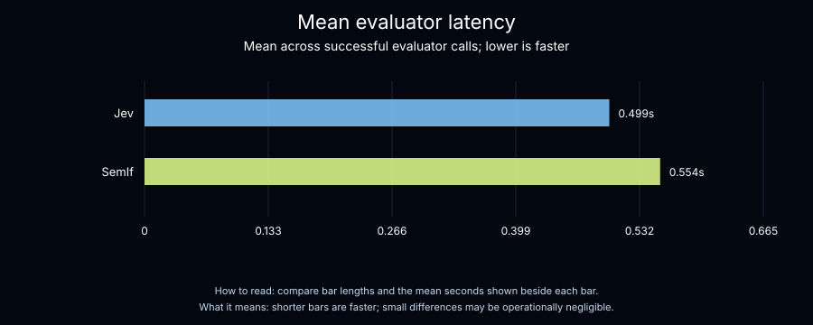

# Jev vs. SemIf

| Metric | Jev | SemIf | Comparison |
|---|---|---|---|
| Quality-score consistency across repeated runs | More consistent | Less consistent | Jev's scores varied less |
| Confidence in the consistency difference | Overlapping range | Overlapping range | The result is directional, not conclusive |
| Consistency in the noisiest case | More consistent | Less consistent | Jev had the smaller worst-case variation |
| Typical response time | Slightly faster | Slightly slower | Performance was similar |

Consistency describes how much quality scores changed when the same five cases were judged 100 times. Response time is measured across successful evaluator calls.

## Variance

## Latency

